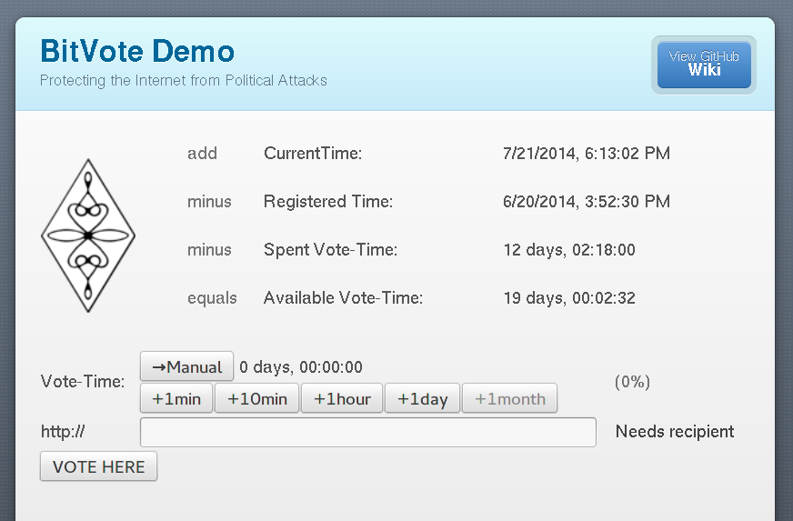
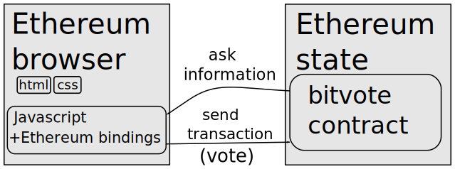
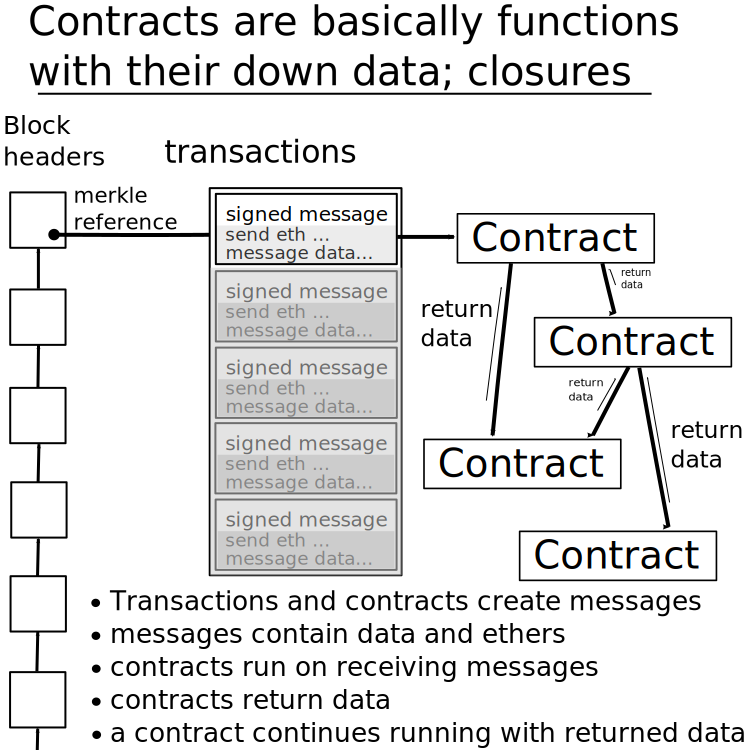

## Bitvote

## What and why

* a voting ecosystem for the future of the internet

* one second per second

* the internet needs protecting 

<!-- vs SOPA for network neutrality, legal attack against 

* existing democratic structures are inadiquate

  + too local
  
  + often ineffective / poorly representative -->

## What we do now/before

* essentially a vote by loudness. Largely it was 'spamming'
  ('twitter storm' in SOPA)
  
* inefficient and not necessary proportional (astroturf)

* can the 'will of the people' be presented by something that is less 'loudness'?

<!--<small style="color:#BBB">Still thank the EFF and co for what good they do get quietly!</small> (distracting)-->

## An Idea

* Everyone gets vote-time, i.e. one second per second &rArr; need to:
  + how vote&sdot;time do voters and votes have
  + have one person - one ID

* If you care about a topic particularly, spend more vote-hours on it

* Topics cover any subject matter. Usually represented with a link.
  (random example)
  + [http://https://www.march-against-monsanto.com](http://https://www.march-against-monsanto.com)

## What it looks like

## 'on-flow'; Button

<button width=100%><table style="text-align:center"><tr><td> </td></tr><tr><td>+ 10 hours</td></tr></table></button>

<button><table><tr><td style="vertical-align:middle"> </td><td style="vertical-align:middle">+ 10 hours</td></tr></table></button>

## Need for **de**centralization

Otherwise:

* Single place to sue/threaten.

* Requires trust towards the operators.

* Just not cool.

## Ethereum

interfaces from arbitrary pages are possible any page can
access the contract state and send transactions

## Ethereum contract recap

## Ethereum contract diagram

## Open problem: Scalibility

+ More people implies more voting weight

+ cant say ‘tough luck’ when contract excution too expensive
  
Ethereum working on it, some ideas that help.

## Open problem: One per ID

Each person should only be able to get one second per second.

Not solid, but ideas:

* Do computer-hard things.
  
* Synchronized computer-hard actions that the contract is somehow aware of.

  Peak demand makes it harder to fool.
    
* Reputation system-like approaches.
    
Note that this is something other things might also want; 'UBI coin'('socialcoin')

## To summarize

* Bitvote is a project to give people a voice.

* Interface is internet-browsing-like, where the browser can read Ethereum state

* Challenges:
  + Large numbers of users &rArr; scalability
  + One person per ID

## Thanks to

* Aaron Bale who came with the idea, and has good ideas on the non-technical side.

  Also for helping me 

* Ethereum!

* Joris Bontje (Pikapay) for hosting this.

## Questions/Responses from the audience

## Appendix: notes

* The browser will likely not be the only way;
  
  anyone is free to develop ways to get data from and send transactions too
  Ethereum contracts.

* We have a wiki on [bitvote.github.io/wiki](https://bitvote.github.io/wiki).

## Appendix: Scaling

* It is listed ontop here
  [github.com/ethereum/wiki/wiki/Problems](https://github.com/ethereum/wiki/wiki/Problems),
  but it is more defining the problem that solving right now.
  (though that is a good first step!)

* Aggegrated signatures.
  ([reddit.com/r/crypto/comments/291hzz/aggregate_signatures/](http://www.reddit.com/r/crypto/comments/291hzz/aggregate_signatures/))

  Basically you have a secret and a public part in public key cryptography.
  
  Signatures are data resulting from a program and the private key that
  indicates that a person signed it.
  
  You can encrypt towards another public key. So the other guy can use his
  private key to open it, he can then also figure the sender public key.
  
  Simplest aggegrate signing would to have a 'public secret' and
  repeatedly encrypting the same message. 
  (not 100% sure that doesnt increase the size, believe so)

* Hanging blocks. It increases space a lot, but it has achillies heel in data
  availability. The current approach solves it with votes, so aggegrate
  signatures matter to it!
  
  [o-jasper.github.io/blog/2014/06/03/hanging_blocks.html](http://o-jasper.github.io/blog/2014/06/03/hanging_blocks.html)

* Treechains are interesting, havent gotten it well.
  (but would expect to hear more if it worked..)

  [mail-archive.com/bitcoin-development@lists.sourceforge.net/msg04388.html](https://www.mail-archive.com/bitcoin-development@lists.sourceforge.net/msg04388.html)
  
  
  "Disentangling Crypto-Coin Mining: Timestamping, Proof-of-Publication, and Validation"
  that links to is interesting.
  (hanging blocks fails basically completely on proof-of-publication)
  
  [mail-archive.com/bitcoin-development%40lists.sourceforge.net/msg03307.html](http://www.mail-archive.com/bitcoin-development%40lists.sourceforge.net/msg03307.html)

* Some other that i could easily have missed.

## More

* Deck.js presentatie: [imakewebthings.com/deck.js/](http://imakewebthings.com/deck.js/)
