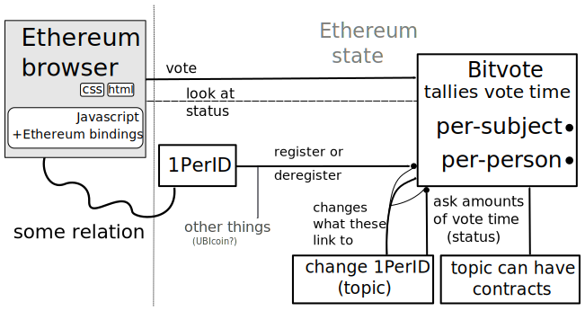

## Bitvote

NOTES: I am jasper den Ouden, will be talking about bitvote.

In order introduce bitvote, i'll start with the reasons the idea sprung up.

## What the internet used to be

* Wide open to new companies

* Wide open to new blogs etcetera

* Optimistic

<small style="color:#888"><a href="http://online.wsj.com/articles/peter-thiel-competition-is-for-losers-1410535536">"Competition is for losers" artikel door Peter Thiel</a></small>

NOTES:

* There was freedom of enterprise because opertunities were not filled.
  Those still exist, but a big company will want to buy you, and simply copy you
  otherwise.
  
* ... blogs had a chance of becoming popular on a large scale, if internet is
  compromised your disadvantage on i.e. search engines could hurt this.
  
  Same for wikis etcetera.

* ... because of that optimistic.

## What it has become and is in danger of becoming

* Television 2.0

* Panopticon

* Seeing... and manipulating!

## xkcd on facebook

I mean, it&#39;s not like we could just demand to see the code that&#39;s
governing our lives. What right do we have to poke around in Facebook&#39;s
private affairs like that

<small style="color:#888">(https://xkcd.com/1390/)</small>

## The idea of Bitvote

Everyone gets vote-time, i.e. one second per second 
&rArr; keep track:

* vote&sdot;time of votes
* one person &harr; one ID

NOTES:

&rArr; vote time is scarce

&rArr; spend according to how much you care

Anyone is free to create a topic; will often be a link.

* [https://www.march-against-monsanto.com](https://www.march-against-monsanto.com)

## What and why

<small style="color:#888">(inspired from http://www.ted.com/talks/simon_sinek_how_great_leaders_inspire_action)</small>

NOTES:

1. Inner ring is freedom of enterprise, freedom of speech and chance to get heard

2. Second ring is the abstract approach 1votehour/hour per person + anyone can
   create opinions to spend it on.
   
3. Outer ring is specific implementation of it.

## What we do now/before

essentially a vote by loudness. Largely it was 'spamming' 
('twitter storm' over SOPA)
  
* inefficient 

* insecure against manipulation (astroturf)

&rarr; can the 'will of the people' be presented by something that is less 'loudness'?

<!--<small style="color:#BBB">Still thank the EFF and co for what good they do get quietly!</small> (distracting)-->

## What it looks like

## Button that is in the flow of internet use

<button width=100%><table style="text-align:center"><tr><td> </td></tr><tr><td>+ 10 hours</td></tr></table></button>

<button><table><tr><td style="vertical-align:middle"> </td><td style="vertical-align:middle">+ 10 hours</td></tr></table></button>

## Need for **de**centralization

Otherwise:

* Requires trust towards the operators.

* Single place to sue/threaten.

* Just not cool.

## More technical bit

## Ethereum

interfaces from arbitrary pages are possible any page can
access the contract state and send transactions

NOTES: bitvote contract is like a ledger anyone can use. Anyone can write
programs/modify ours, in order to have their own view of it.

## Ethereum contracts recap

Contracts are programs

run if they receive a message

NOTES: Messages can also send ethers.

## Ethereum contracts recap(2)

Transactions insert messages &nbsp;

## The Bitvote contract diagram

## Open problem: Scalibility

+ More people implies more voting weight

+ when contract execution too expensive 
  cant say ‘tough luck’
  
NOTES: Ethereum working on it, some ideas that help.

## Open problem: One per ID

Each person should only be able to get one second per second.

Not solid, but ideas:

* Do computer-hard things.
  
  + Synchronizing to make faking harder.
    
* Reputation network -like approaches

  + 'Detectives' point out doubles and 'punishing' nodes that vouched for it
    
Note that this is something other things might also want; 'UBI coin'('socialcoin')

## To summarize

* Bitvote is a project to give people a voice.

* Interface is internet-browsing-like, where the browser can read Ethereum state

* Challenges:
  + Large numbers of users &rArr; scalability
  + One person per ID

## Thanks to

* Aaron Bale who came with the idea, and has good ideas on the non-technical side.

  Also for helping me 

* Ethereum!

## Questions/Responses from the audience

## Appendix: notes

* The browser will likely not be the only way;
  
  anyone is free to develop ways to get data from and send transactions too
  Ethereum contracts.

* We have a wiki on [bitvote.github.io/wiki](https://bitvote.github.io/wiki).

## Appendix: Scaling

* It is listed ontop here
  [github.com/ethereum/wiki/wiki/Problems](https://github.com/ethereum/wiki/wiki/Problems),
  but it is more defining the problem that solving right now.
  (though that is a good first step!)

* Aggegrated signatures.
  ([reddit.com/r/crypto/comments/291hzz/aggregate_signatures/](http://www.reddit.com/r/crypto/comments/291hzz/aggregate_signatures/))

  Basically you have a secret and a public part in public key cryptography.
  
  Signatures are data resulting from a program and the private key that
  indicates that a person signed it.
  
  You can encrypt towards another public key. So the other guy can use his
  private key to open it, he can then also figure the sender public key.
  
  Simplest aggegrate signing would to have a 'public secret' and
  repeatedly encrypting the same message. 
  (not 100% sure that doesnt increase the size, believe so)

* Hanging blocks. It increases space a lot, but it has achillies heel in data
  availability. The current approach solves it with votes, so aggegrate
  signatures matter to it!
  
  [o-jasper.github.io/blog/2014/06/03/hanging_blocks.html](http://o-jasper.github.io/blog/2014/06/03/hanging_blocks.html)

* Three scalability on blog.ethereum posts
  [1](https://blog.ethereum.org/2014/09/17/scalability-part-1-building-top/),
  [2](https://blog.ethereum.org/2014/10/21/scalability-part-2-hypercubes/), 
  [3](https://blog.ethereum.org/2014/11/13/scalability-part-3-metacoin-history-multichain/).

## More

* Deck.js presentatie: [imakewebthings.com/deck.js/](http://imakewebthings.com/deck.js/)
